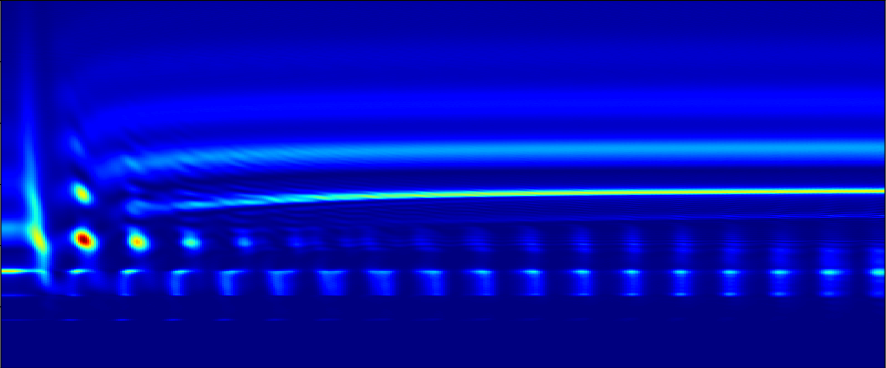
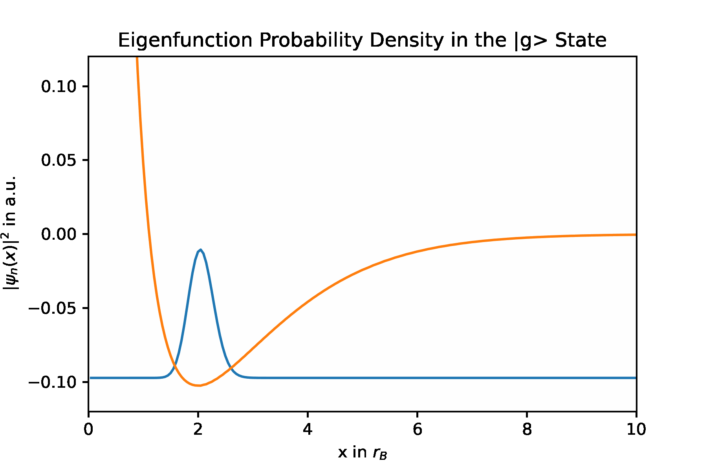
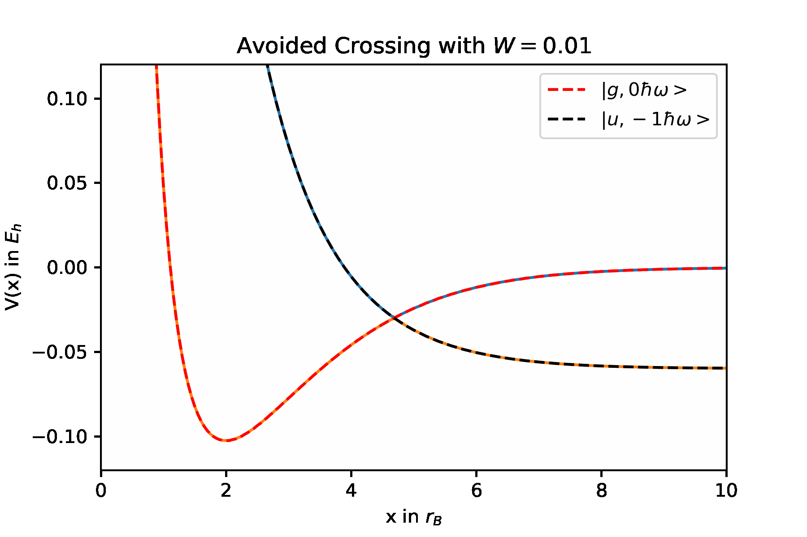
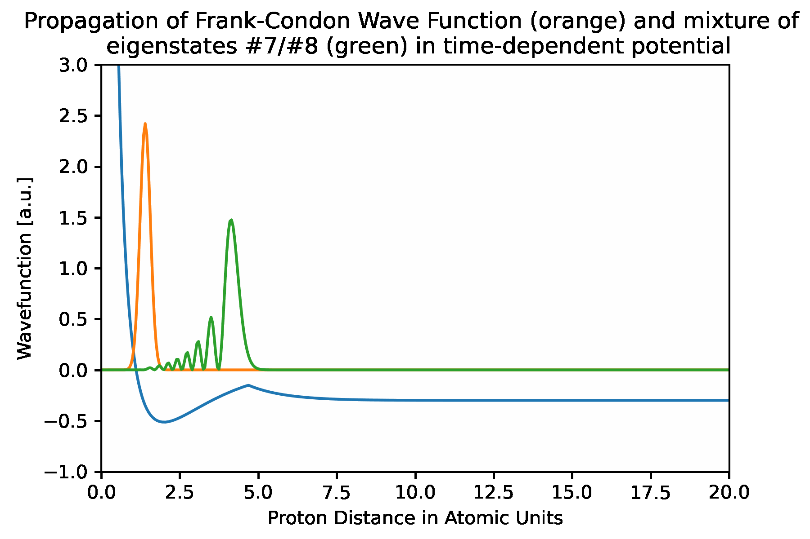
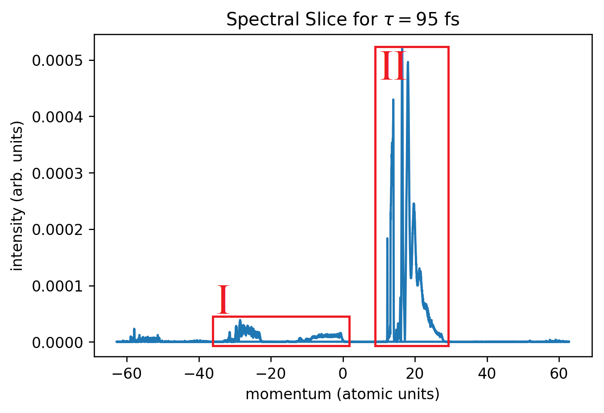

# Dissociation Dynamics of H2+ in XUV and IR laser fields

Final project of Computational Quantum Dynamics lecture some years ago. Project and 
[report](https://dl.orangedox.com/H2DissociationDynamics) made together with @kkiefer, renewed.

   

## Methods

The following methods should be used:

* [Finite difference method](https://en.wikipedia.org/wiki/Finite_difference_method)
* [Exact diagonalization](https://en.wikipedia.org/wiki/Exact_diagonalization)
* [Split-step Fourier method](https://en.wikipedia.org/wiki/Split-step_method)
* [Fourier analysis](https://en.wikipedia.org/wiki/Split-step_method)

## Data

The following data is provided in atomic units and stored in csv format:

* dipole_coupling.dat: (R-dependent) dipole matrix between relevant states
* H2nuclwf.dat: H2 ground state wave function (initial state)
* H2p_pot_gerade.dat: Born-Oppenheimer surface of one relevant state (binding)
* H2p_pot_ungerade.dat: Born-Oppenheimer surface of other relevant state (non-binding)

Hints:

1. Not all the data is given on the same spatial grid,
   so you may have to interpolate and extrapolate.
2. Also, the given grid spacing and size may not be optimal for the numerical
   integration that you do. Think carefully about your choice of grid size
   and spacing, also to not waste computational resources!
3. The dipole operator is non-diagonal in the internal states.
   How to handle this issue to still get good computational performance
   is the crux of the problem. 
   
Atomic Units:

1. Length in Bohr radii (r_0 = 0.529177 1e-10 m)
2. Energy given in Hartree energies (E_H = 27.211 eV)
3. For further (e.g. time) see [here](https://de.wikipedia.org/wiki/Atomare_Einheiten) or
   [here](https://en.wikipedia.org/wiki/Hartree_atomic_units#Units)

## Steps

### 1. Find the vibrational eigenstates in the H2+ ground state potential

   

Methods:

* Exact diagonalization
* Finite difference method

### 2. Simulate the wave packet propagation without the IR laser field

   

Methods:

* Split-step fourier
* Fourier analysis

### 3. Simulate the dynamics of the time-dependent system

   

Methods:

* Split-step fourier
* Fourier analysis

### 4. Scan the delay time and analyze the momentum distribution

   

Methods:

* Exact diagonalization
* Split-step fourier
* Fourier analysis

## References

* [Molecular Dissociative Ionization and Wave-Packet Dynamics Studied Using Two-Color XUV and IR Pump-Probe Spectroscopy, Kelkensberg et al. 2009](https://journals.aps.org/prl/abstract/10.1103/PhysRevLett.103.123005)
* [Molecular wave-packet dynamics on laser-controlled transition states, Fischer et al. 2016](https://journals.aps.org/pra/abstract/10.1103/PhysRevA.93.012507)
* [Avoided Crossing for understanding of Dipole-Coupling](https://www.univie.ac.at/columbus/workshops/Tianjin2016/Lectures/PLASSER/FP2_handout.pdf)
* [Project Description](https://uebungen.physik.uni-heidelberg.de/uebungen/download/4233/Programming%20projects.pdf)
